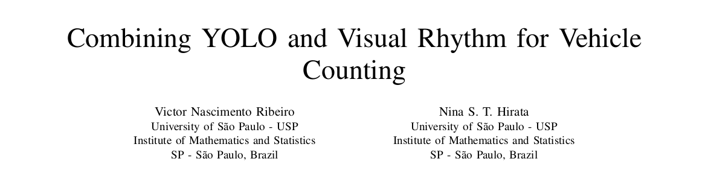

<br>

**This work presents an alternative and more efficient method for counting vehicles in videos using Deep Learning and Computer Vision techniques.**

> Conducted at the [University of São Paulo - USP](https://www5.usp.br/) under the guidance of [Prof. Nina S. T. Hirata](https://www.ime.usp.br/nina/).

We developed a system that combines YOLO, for vehicle detection, with Visual Rhythm (VR), a way to create time-spatial images. This integration enhances the system's efficiency by approximately 3 times when compared with conventional methods while maintaining similar accuracy.

<br>

**The work participated in::** 
- [SIBGRAPI](https://sibgrapi.sbc.org.br/sibgrapi2023/) – Conference on Graphics Patterns and Images, within the Workshop of Undergraduate Works (WUW). It is an annual academic conference held in Brazil that focuses on computer graphics, image processing, computer vision, and related fields.
- [SIICUSP](https://prpi.usp.br/siicusp/) – International Seminar on Scientific and Technological Initiation of the University of São Paulo. The event provides a platform for undergraduate students to present their scientific and technological research projects.

[Link to the paper](https://www.ime.usp.br/nina/)

<br>


<div align="center">
  Data flow in the VR–based video counting vehicles
</div>

<br>

**Requirements**
```sh
numpy
opencv-python
ultralytics
```
