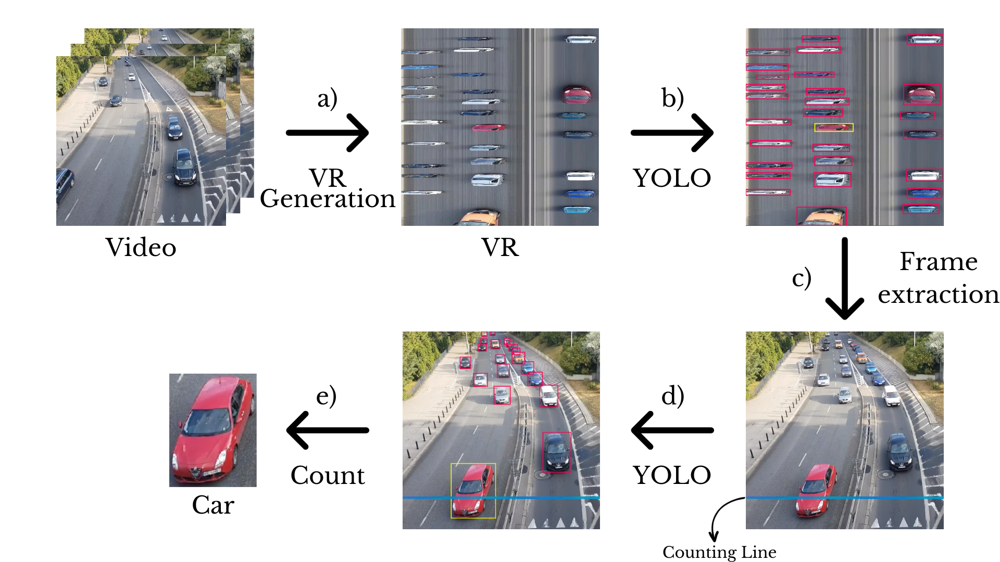

# Combining YOLO and Visual Rhythm for Vehicle Counting

This repository is the official implementation of [Combining YOLO and Visual Rhythm for Vehicle Counting]

**Authors**: Victor N. Ribeiro and Nina S. T. Hirata


<br>


**This work presents an alternative and more efficient method for counting vehicles in videos using Deep Learning and Computer Vision techniques.**

> Conducted at the [University of São Paulo - USP](https://www5.usp.br/) under the guidance of [Prof. Nina S. T. Hirata](https://www.ime.usp.br/nina/).

We developed a system that combines YOLO, for vehicle detection, with Visual Rhythm (VR), a way to create time-spatial images. This integration enhances the system's efficiency by approximately 3 times when compared with conventional methods while maintaining similar accuracy.


<br>


<div align="center">
  
  <p>
    Data flow in the VR–based video counting vehicles
  </p>
</div>


<br>


## Events

**The work participated in:** 
- [SIBGRAPI](https://sibgrapi.sbc.org.br/sibgrapi2023/) (**Honorable Mention**) – Conference on Graphics Patterns and Images, within the Workshop of Undergraduate Works (WUW). It is an annual academic conference held in Brazil that focuses on computer graphics, image processing, computer vision, and related fields.
- [SIICUSP](https://prpi.usp.br/siicusp/) – _Simpósio Internacional de Iniciação Científica e Tecnológica da USP_ (International Symposium on Scientific and Technological Initiation at USP). The event provides a platform for undergraduate students to present their scientific and technological research projects.

[Link to the paper](https://drive.google.com/file/d/1wVH4HC0ClA7rfVMxXEBE4QctVhcGZBMU/view?usp=sharing)


<br>


## Usage

This codebase is written for ```python3```

```bash
# Clone this repository
git clone https://github.com/victor-nasc/YOLO-Visual-Rhythm-Vehicle-Counting.git

# Install dependencies
pip install -r requirements.txt

# Run the program
python3 count.py [--OPTIONS]

# --[OPTIONS]
#    --line: Line position                           [default: 600]
#    --interval: Interval between VR images (frames) [default: 900]
#    --save-VR: Enable saving VR images              [default: False]
#    --save-vehicle: Enable saving vehicle images    [default: False]
#    
#    The video path is prompted during execution.
```


<br>


## Citation

If you find the code useful in your research, please consider citing our paper:

```
...
```

